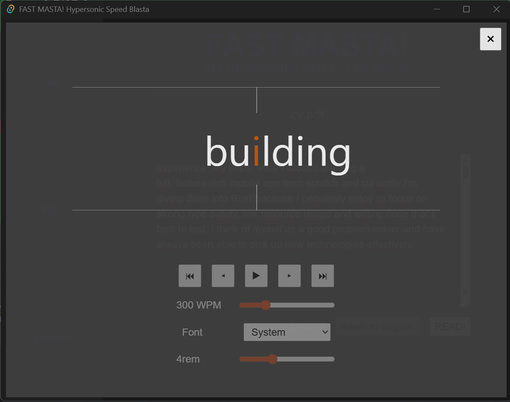

# FAST MASTA! Hypersonic Speed Blasta

Speed reader hobby project

# Installation
1. Clone repo
2. Run `npm run tauri build`
3. Find the installer in `your-directory/src-tauri/target/release/bundle/`

# Loading text to read

## 1. Inserting Text

Paste your text in the textarea and hit Ctrl+Enter (or "READ!")

## 2. Loading a PDF

Select or drag a .pdf file. It is then loaded into the textarea, where you can edit it first. Hit Ctrl+Enter (or "READ!")

## 3. Loading a Website

Provide a valid URL and hit "Fetch", the content is then loaded into the textarea, where you can edit it first. Hit Ctrl+Enter (or "READ!")

# Reading text

1. Hit `space` to toggle play/pause.
2. You can use your `left` and `right` arrow on the keyboard to go to the next word, when in pause-mode.
3. Adjust "WPM" (words per minute) to increase/decrease the reading speed.
4. Adjust "Font" to choose your desired font family.
5. Adjust "REM" to increase/decrease the font size.

# Roadmap

1. Add a local `sqlite` database

	1.1. Persist settings

	1.2. Persist reading progress

2. Replace Tauri icon